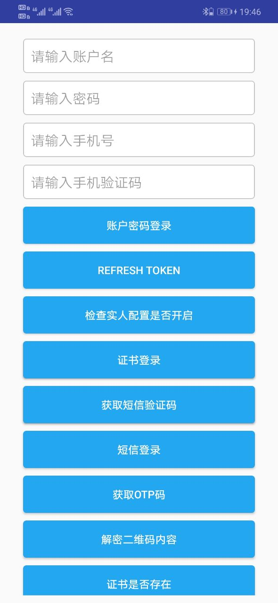
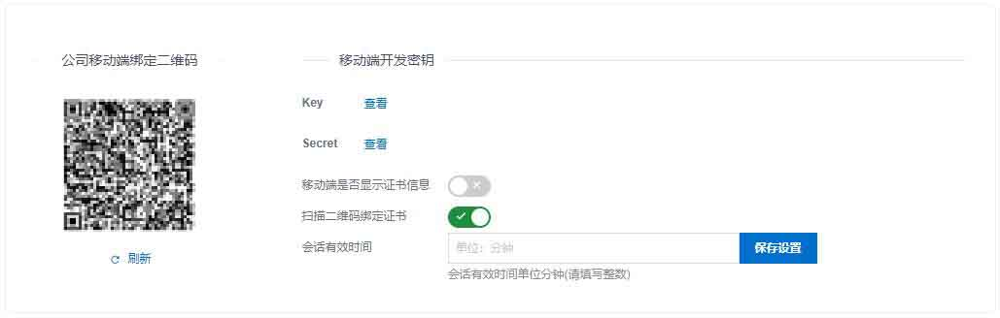

# IDaaS Android SDK 集成文档

## 一.IDaaS Android SDK介绍

IDASS 移动端SDK为用户提供一套接入IDaaS能力，让开发者快速集成。SDK提供以下能力

- [x] 账号密码登录
- [x] 证书登录
- [x] 短信登录
- [x] 扫码登录
- [x] OTP登录
- [x] 指纹认证
- [x] 实人认证
- [x] 手势认证

## 二.SDK DEMO 展示



## 三.使用前准备

> 前提：需要有部署IDaas的实例。

在【设置】【安全设置】【移动端绑定设置】菜单中获取移动端开发密钥




## 四.如何集成

- 1.导入需要的依赖库

    ```groovy
    implementation 'com.squareup.okhttp3:okhttp:3.12.0'
    implementation 'com.squareup.okio:okio:1.16.0'
    implementation 'com.squareup.okhttp3:logging-interceptor:3.12.0'
    implementation 'com.google.code.gson:gson:2.8.5'
    implementation group: 'org.slf4j', name: 'slf4j-log4j12', version: '1.7.5'

    implementation(name: 'idp4zerotrustlibrary-release', ext: 'aar')
    implementation(name: 'verificationtypelibrary-release', ext: 'aar')


    ```
 - 下载地址

     [idp4zerotrustlibrary_v2-release.aar](app/libs/idp4zerotrustlibrary_v2-release.aar) 

     [verificationtypelibrary-v1.3-release.aar](app/libs/verificationtypelibrary-v1.3-release.aar) 
 
    - 其中 **idp4zerotrustlibrary-release** 为证书登录IDaaS相关，**verificationtypelibrary-release** 主要是提供指纹和手势能力，用于指纹免密登录等场景。

- 给相应权限

  ```xml
  <!-- 以下权限需要集成方根据Android系统动态自行获取。-->
      <uses-permission android:name="android.permission.INTERNET" />
      <uses-permission android:name="android.permission.CAMERA" />
      <uses-permission android:name="android.permission.USE_FINGERPRINT" />
      <uses-permission android:name="android.permission.READ_PHONE_STATE" />
      <uses-permission android:name="android.permission.WRITE_EXTERNAL_STORAGE" />
      <uses-permission android:name="android.permission.READ_EXTERNAL_STORAGE" />
      <uses-permission android:name="android.permission.ACCESS_COARSE_LOCATION" />
      <uses-permission android:name="android.permission.ACCESS_FINE_LOCATION" />
  ```

    - 具体权限需要根据调用的功能去获取。

- 需要在Application的继承类的onCreate方法中初始化SDK信息

  ```java
    String appKey = "9e2dae******************************lnd3uby";
    String appSecret = "RRGr7y*******************************FaKjG";
    String enterpriseId = "AAAAA";
    String host = "https://AAAAA.idsmanager.com/";
    CertificateLogin.getInstance(this)
          .appKey(appKey)
          .appSecret(appSecret)
          .enterpriseId(enterpriseId)
          .host(host);
  ```
    
    - 以上参数根据IDaaS管理员获取自身对应的数据。

## 五.SDK调用

### 1. 账户密码登录

```java

/**
     * 账户密码登录
     * @param username  IDaaS账户名
     * @param pwd IDaaS账户密码
     * @param pwdLoginService
     */
//账户密码登录，需要自行获取手机号权限 Manifest.permission.READ_PHONE_STATE
CertificateLogin.getInstance(MainActivity.this).pwdLogin(username, password, new PwdLoginService() {
    @Override
    public void onSuccess(String result) {
        Log.d(TAG, "onSuccess() called with: result = [" + result + "]");
        runOnUiThread(new Runnable() {
            @Override
            public void run() {
                Toast.makeText(MainActivity.this, "登录成功", Toast.LENGTH_SHORT).show();
            }
        });

        //{"success":true,"code":"200","message":null,"requestId":"4645D1E3-B5E9-4635-A568-AEAF46793241","data":{"accessTokenDto":{"errorDescription":null,"error":null,"errors":[],"accessToken":"2f308def-cc27-49b4-b62a-93355cc470f9","tokenType":"bearer","refreshToken":"3ef89139-7884-4d44-908b-8728e825cccc","scope":"read","expiresIn":32528,"includeError":false},"secret":"inputYourCodeHere","userInfo":{"username":"***","userId":"***","fullName":"***","phone":null,"departmentName":null,"displayName":"***","photo":null,"realNameFlag":false,"enableRealName":false},"serverTime":1588056647852,"admin":false,"authKeyDto":null,"needModifyPwd":false,"expiredReminder":true,"idToken":null}}
    }

    @Override
    public void onFail(String errorCode, String errors) {
        Log.d(TAG, "onFail() called with: errorCode = [" + errorCode + "], errors = [" + errors + "]");
    }
});
```

### 2. 刷新TOKEN

```java
 //刷新Token
        CertificateLogin.getInstance(MainActivity.this).refreshUserAccessToken(refreshToken, new RefreshUserAccessTokenService() {
            @Override
            public void onSuccess(final String result) {
                //result = [{"success":true,"code":"200","message":null,"requestId":null,"data":{"uuid":"23a34246c75879d76501ef89d88a0addd2dnsH4Q5H5","createTime":"2020-10-16 12:04","archived":false,"enterpriseUuid":"7c2cec4d2408d16e024db37542997ad8knZ65rWW2ZC","udAccountUuid":"4ae77e1fdec58c9bbc5dfcec2e94c9fdt3v40U8kCmu","username":"方***","useVendorAuth":"ALI_CLOUD","authResult":200,"authResultInfo":"认证通过","frontImgFileUuid":"c5ea1c5dd9710fe***f9b6d15gfyQjzRjeUL","backImgFileUuid":"e1ea803c20946***585ewH2RAS00Hdh","faceImgFileUuid":"91a474b53aff85***bd7612PNnJ2uKMcf2","idCardNumber":"34***90","sex":"Male","nationality":"汉","address":"安徽省***","startDate":"20120809","endDate":"20220809","authority":"某某公安局"}}]
                Log.d(TAG, "checkUserRealPerson onSuccess() called with: result = [" + result + "]");
                showMessage("checkUserRealPerson onSuccess() called with: result = [" + result + "]");
            }

            @Override
            public void onFail(String errorCode, String errors) {
                Log.d(TAG, "checkUserRealPerson onFail() called with: errorCode = [" + errorCode + "], errors = [" + errors + "]");
            }
        });
```

### 3. 查询实人认证是否开启

```java
CertificateLogin.getInstance(MainActivity.this).checkRealPersonConfiguration(accessToken, new RealPersonConfigurationCheckService() {
    @Override
    public void onSuccess(String result) {
        //result = [实人认证已开启。]
        Log.d(TAG, "onSuccess() called with: result = [" + result + "]");
        showMessage("onSuccess() called with: result = [" + result + "]");
    }

    @Override
    public void onFail(String errorCode, String errors) {
        Log.d(TAG, "onFail() called with: errorCode = [" + errorCode + "], errors = [" + errors + "]");
        showMessage("onFail() called with: errorCode = [" + errorCode + "], errors = [" + errors + "]");
    }
});
//检查是否实人
CertificateLogin.getInstance(MainActivity.this).checkUserRealPerson(accessToken, new CheckUserRealPersonService() {
    @Override
    public void onSuccess(String result) {
        //result = [{"success":true,"code":"200","message":null,"requestId":null,"data":{"uuid":"23a34246c75879d76501ef89d88a0addd2dnsH4Q5H5","createTime":"2020-10-16 12:04","archived":false,"enterpriseUuid":"7c2cec4d2408d16e024db37542997ad8knZ65rWW2ZC","udAccountUuid":"4ae77e1fdec58c9bbc5dfcec2e94c9fdt3v40U8kCmu","username":"方***","useVendorAuth":"ALI_CLOUD","authResult":200,"authResultInfo":"认证通过","frontImgFileUuid":"c5ea1c5dd9710fe***f9b6d15gfyQjzRjeUL","backImgFileUuid":"e1ea803c20946***585ewH2RAS00Hdh","faceImgFileUuid":"91a474b53aff85***bd7612PNnJ2uKMcf2","idCardNumber":"34***90","sex":"Male","nationality":"汉","address":"安徽省***","startDate":"20120809","endDate":"20220809","authority":"某某公安局"}}]
        Log.d(TAG, "checkUserRealPerson onSuccess() called with: result = [" + result + "]");
        showMessage("checkUserRealPerson onSuccess() called with: result = [" + result + "]");
    }

    @Override
    public void onFail(String errorCode, String errors) {
        Log.d(TAG, "checkUserRealPerson onFail() called with: errorCode = [" + errorCode + "], errors = [" + errors + "]");
        showMessage("checkUserRealPerson onFail() called with: errorCode = [" + errorCode + "], errors = [" + errors + "]");
    }
});
```

### 4. 开始实人认证

```java
CertificateLogin.getInstance(MainActivity.this).startRealPerson(accessToken, username, new VerifyTokenService() {
    @Override
    public void onSuccess(String result) {
        //result = [{"success":true,"code":"200","message":null,"requestId":"1CC63C03-BBBD-4BBC-82F9-B875451F71F3","data":{"bizId":"8e566a514ee4b974cbb0ae1e11b4e4cfp6PQpj8dlEH","verifyToken":"e1410994df974a96bf733734e7f1ffa0"}}]
        Log.d(TAG, "onSuccess() called with: result = [" + result + "]");
        JSONObject jsonObject = (JSONObject) JSONObject.parse(result);
        Boolean success = jsonObject.getBoolean("success");
        if (success) {
            JSONObject data = jsonObject.getJSONObject("data");
            String verifyToken = data.getString("verifyToken");
            String bizId = data.getString("bizId");
            startVerify(verifyToken, bizId);
        }
        showMessage("onSuccess() called with: result = [" + result + "]");
    }

    @Override
    public void onFail(String errorCode, String errors) {
        Log.d(TAG, "onFail() called with: errorCode = [" + errorCode + "], errors = [" + errors + "]");
        showMessage("onFail() called with: errorCode = [" + errorCode + "], errors = [" + errors + "]");
    }
});
```

### 5. 人脸活体验证

```
CertificateLogin.getInstance(MainActivity.this).startFaceAuth(userId, new StartFaceAuthService() {
    @Override
    public void onSuccess(String result) {
        //result = [{"success":true,"code":"200","message":null,"requestId":"2211C865-4B8A-4904-B425-BB66F672F227","data":{"bizId":"a6dcaa2a70a94bb0078d654a028e10bbX83EJb9ZTsH","verifyToken":"d7202615824247b88c7de98b763ede25"}}]
        Log.d(TAG, "onSuccess() called with: result = [" + result + "]");
        JSONObject jsonObject = (JSONObject) JSONObject.parse(result);
        Boolean success = jsonObject.getBoolean("success");
        if (success) {
            JSONObject data = jsonObject.getJSONObject("data");
            String verifyToken = data.getString("verifyToken");
            String bizId = data.getString("bizId");
            startFaceVerify(verifyToken, bizId);
        }
        showMessage("onSuccess() called with: result = [" + result + "]");
    }

    @Override
    public void onFail(String errorCode, String errors) {
        Log.d(TAG, "onFail() called with: errorCode = [" + errorCode + "], errors = [" + errors + "]");
        showMessage("onFail() called with: errorCode = [" + errorCode + "], errors = [" + errors + "]");
    }
});
```

### 6. 下载证书

```java
/**
     * 账户密码下载证书
     *
     * @param username 账户名
     * @param pwd      密码
     * @param downloadCertService 
     */
//下载证书,自行获取Manifest.permission.READ_PHONE_STATE，Manifest.permission.WRITE_EXTERNAL_STORAGE权限
CertificateLogin.getInstance(MainActivity.this).downloadCert(username, password, new DownloadCertService() {
    @Override
    public void onSuccess(String result) {
        Log.d(TAG, "onSuccess() called with: result = [" + result + "]");
        runOnUiThread(new Runnable() {
            @Override
            public void run() {
                Toast.makeText(MainActivity.this, "下载证书成功", Toast.LENGTH_SHORT).show();
            }
        });

    }

    @Override
    public void onFail(String errorCode, String errors) {
        Log.d(TAG, "onFail() called with: errorCode = [" + errorCode + "], errors = [" + errors + "]");
    }
});
```

### 7. 证书是否存在

```java
boolean existence = CertificateLogin.getInstance(MainActivity.this).certExistence();
```

### 8. 证书登录

```java
/**
     * 证书登录是个耗时操作，建议加loading。需要自行获取手机号权限 	   Manifest.permission.READ_PHONE_STATE
     *
     * @param certLoginService
     */
CertificateLogin.getInstance(MainActivity.this).certLogin(new CertLoginService() {
    @Override
    public void onSuccess(String result) {
        Log.d(TAG, "onSuccess() called with: result = [" + result + "]");
        //{"success":true,"code":"200","message":null,"requestId":"8AD0646D-8850-4958-9A2D-3A6D8DB8476D","data":{"accessTokenDto":{"errorDescription":null,"error":null,"errors":[],"accessToken":"2f308def-cc27-49b4-b62a-93355cc470f9","tokenType":"bearer","refreshToken":"3ef89139-7884-4d44-908b-8728e825cccc","scope":"read","expiresIn":43199,"includeError":false},"secret":"inputYourCodeHere","userInfo":{"username":"***","userId":"***","fullName":"","phone":null,"departmentName":null,"displayName":"","photo":null,"realNameFlag":false,"enableRealName":false},"serverTime":1588045976209,"admin":false,"authKeyDto":null,"needModifyPwd":false,"expiredReminder":false,"idToken":null}}
        runOnUiThread(new Runnable() {
            @Override
            public void run() {
                Toast.makeText(MainActivity.this, "登录成功", Toast.LENGTH_SHORT).show();
            }
        });

    }

    @Override
    public void onFail(String errorCode, String errors) {
        Log.d(TAG, "onFail() called with: errorCode = [" + errorCode + "], errors = [" + errors + "]");
    }
});
```

### 9. 获取短信验证码

```java
CertificateLogin.getInstance(MainActivity.this).obtainSmsVerificationCodeLogin(username,phonenumber, new ObtainSmsVerificationCodeService() {
    @Override
    public void onSuccess(final String result) {
        //result = [{"success":true,"code":"200","message":null,"requestId":null,"data":{"uuid":"23a34246c75879d76501ef89d88a0addd2dnsH4Q5H5","createTime":"2020-10-16 12:04","archived":false,"enterpriseUuid":"7c2cec4d2408d16e024db37542997ad8knZ65rWW2ZC","udAccountUuid":"4ae77e1fdec58c9bbc5dfcec2e94c9fdt3v40U8kCmu","username":"方***","useVendorAuth":"ALI_CLOUD","authResult":200,"authResultInfo":"认证通过","frontImgFileUuid":"c5ea1c5dd9710fe***f9b6d15gfyQjzRjeUL","backImgFileUuid":"e1ea803c20946***585ewH2RAS00Hdh","faceImgFileUuid":"91a474b53aff85***bd7612PNnJ2uKMcf2","idCardNumber":"34***90","sex":"Male","nationality":"汉","address":"安徽省***","startDate":"20120809","endDate":"20220809","authority":"某某公安局"}}]
        Log.d(TAG, "loadSmsVerificationCode onSuccess() called with: result = [" + result + "]");
        showMessage("loadSmsVerificationCode onSuccess() called with: result = [" + result + "]");
    }

    @Override
    public void onFail(String errorCode, String errors) {
        Log.d(TAG, "loadSmsVerificationCode onFail() called with: errorCode = [" + errorCode + "], errors = [" + errors + "]");
        showMessage("loadSmsVerificationCode onFail() called with: errorCode = [" + errorCode + "], errors = [" + errors + "]");
    }
});
```

### 10. 短信验证码登录

```java
    CertificateLogin.getInstance(MainActivity.this).smsVerificationCodeLogin(username, captcha, new SmsVerificationCodeLoginService() {
        @Override
        public void onSuccess(final String result) {
            //result = [{"success":true,"code":"200","message":null,"requestId":null,"data":{"uuid":"23a34246c75879d76501ef89d88a0addd2dnsH4Q5H5","createTime":"2020-10-16 12:04","archived":false,"enterpriseUuid":"7c2cec4d2408d16e024db37542997ad8knZ65rWW2ZC","udAccountUuid":"4ae77e1fdec58c9bbc5dfcec2e94c9fdt3v40U8kCmu","username":"方***","useVendorAuth":"ALI_CLOUD","authResult":200,"authResultInfo":"认证通过","frontImgFileUuid":"c5ea1c5dd9710fe***f9b6d15gfyQjzRjeUL","backImgFileUuid":"e1ea803c20946***585ewH2RAS00Hdh","faceImgFileUuid":"91a474b53aff85***bd7612PNnJ2uKMcf2","idCardNumber":"34***90","sex":"Male","nationality":"汉","address":"安徽省***","startDate":"20120809","endDate":"20220809","authority":"某某公安局"}}]
            Log.d(TAG, "smsVerificationCodeLogin onSuccess() called with: result = [" + result + "]");
            showMessage("smsVerificationCodeLogin onSuccess() called with: result = [" + result + "]");
        }

        @Override
        public void onFail(String errorCode, String errors) {
            Log.d(TAG, "smsVerificationCodeLogin onFail() called with: errorCode = [" + errorCode + "], errors = [" + errors + "]");
            showMessage("smsVerificationCodeLogin onFail() called with: errorCode = [" + errorCode + "], errors = [" + errors + "]");
        }
    });
```

### 11. 获取OTP码

```java
/**
     * 获取otp码
     * 
     * @param time 周期，默认设置30
     * @param secret 用户秘钥，用于生成otp码
     * @return
     */
String otp = CertificateLogin.getInstance(MainActivity.this).getOTPNumber(30, "7SY445RWS3LLI27K");
```

### 12. 解密二维码内容

```java
/**
     * 解密扫码的值
     *
     * @param encryptQRCode 扫码的加密值
     * @return 二维码解密值
     */
String qr = "{\"authKey\":\"9KE7bBa3bKkQqeZV\",\"info\":\"HoAFoViqbrQ2x3y6SyqEbMwYqhYZqDZ7xPpRoEF1F+BAZ/By9GlMvB8SyPvTmFVHA3EpSRigPumYm3AsTeMGHY987dyNbQs/KCtdYXJn00o=\"}";
String decryptQRCode = CertificateLogin.getInstance(MainActivity.this).decryptQRCode(qr);
```

### 13. 扫码登录IDP

```java
/**
     * 扫码登录IDP
     *
     * @param accessToken 用户登录IDaaS后获取的accessToken
     * @param oneTimeLoginQRCode PC端二维码的内容
     * @param oneTimeLoginService 
     */
CertificateLogin.getInstance(MainActivity.this).oneTimeLogin("{\"authKey\":\"9KE7bBa3bKkQqeZV\",\"info\":\"HoAFoViqbrQ2x3y6SyqEbMwYqhYZqDZ7xPpRoEF1F+BAZ/By9GlMvB8SyPvTmFVHA3EpSRigPumYm3AsTeMGHY987dyNbQs/KCtdYXJn00o=\"}", "a6c321c8-4608-4d2c-9785-3c5870bf8419", new OneTimeLoginService() {
    @Override
    public void onSuccess(String result) {
        Log.d(TAG, "onSuccess: result=" + result);
        //{"success":true,"code":"200","message":"","requestId":"B81429E0-5182-4961-B877-EE6296803778","data":null}
        runOnUiThread(new Runnable() {
            @Override
            public void run() {
                Toast.makeText(MainActivity.this, "登录成功", Toast.LENGTH_SHORT).show();
            }
        });

    }

    @Override
    public void onFail(String errorCode, String errors) {
        Log.d(TAG, "onFail: errorCode=" + errorCode + ";errors=" + errors);
    }
});
```

### 14. 获取已授权应用列表

```java
/**
     * 获取已授权的应用列表
     *
     * @param accessToken 用户登录IDaaS后获取的accessToken
     * @param loadAppsService
     */
CertificateLogin.getInstance(MainActivity.this).loadApps("a6c321c8-4608-4d2c-9785-3c5870bf8419", new LoadAppsService() {
    @Override
    public void onSuccess(String result) {
        Log.d(TAG, "onSuccess() called with: result = [" + result + "]");
        //{"success":true,"code":"200","message":null,"requestId":"C6187E47-0DB3-4030-9E15-ED7A1E546A87","data":{"applicationList":[]}}
        runOnUiThread(new Runnable() {
            @Override
            public void run() {
                Toast.makeText(MainActivity.this, "获取应用列表成功", Toast.LENGTH_SHORT).show();
            }
        });

    }

    @Override
    public void onFail(String errorCode, String errors) {
        Log.d(TAG, "onFail() called with: errorCode = [" + errorCode + "], errors = [" + errors + "]");
    }
});
```

### 15. 指纹认证

```java
//指纹登录,需要自行获取指纹权限
BiometricManager biometricManager = BiometricManager.getInstance(MainActivity.this);
boolean biometricPromptEnable = biometricManager.isBiometricPromptEnable();
if (biometricPromptEnable) {
    biometricManager.authenticate(new OnBiometricIdentifyService() {
        @Override
        public void onUsePassword() {
            Log.d(TAG, "onUsePassword() called");
        }

        @Override
        public void onSucceeded() {
            Log.d(TAG, "onSucceeded() called");
            certLogin();
        }

        @Override
        public void onFailed() {
            Log.d(TAG, "onFailed() called");
        }

        @Override
        public void onError(int code, String reason) {
            Log.d(TAG, "onError() called with: code = [" + code + "], reason = [" + reason + "]");
        }

        @Override
        public void onCancel() {
            Log.d(TAG, "onCancel() called");
        }
    }, new BiometricPromptDialog());
}
```

### 16. 手势认证

```
Intent intent = new Intent(this, GestureActivity.class);
startActivity(intent);
```
